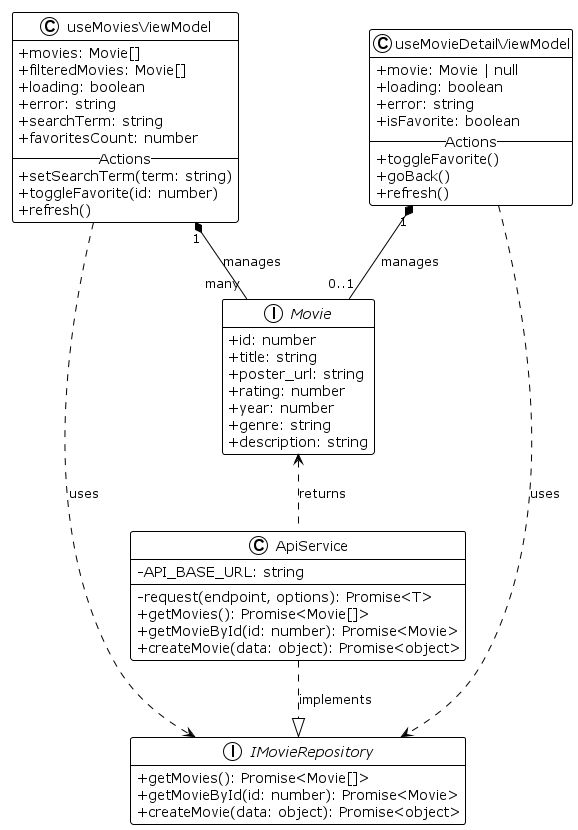
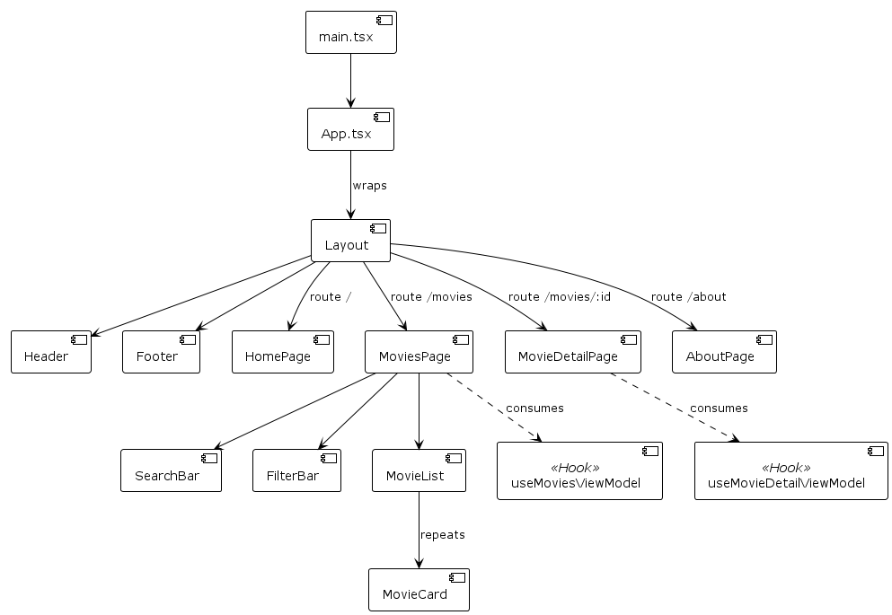

# ProyectoCine - React + Vite

Esta es una página web para la gestión y visualización de películas, desarrollada con **React**, **TypeScript** y **Vite**. El proyecto implementa una arquitectura escalable basada en el patrón **MVVM** (Model-View-ViewModel) y **Repositorio**.

## Instalación y Configuración

### 1. Instalar dependencias
Ejecuta el siguiente comando en la raíz del proyecto para instalar las librerías necesarias:

npm install
2. Gestión de Credenciales (Obligatorio)
Para cumplir con los requisitos de seguridad y conexión a TMDB, debes configurar las variables de entorno:

Crea un archivo llamado .env.local en la raíz del proyecto.

Añade tu clave API de TMDB siguiendo este formato:

Properties

VITE_TMDB_API_KEY="4b1f4c72951b2d461774c123fb74109c"
Nota: El archivo .env.local está configurado en .gitignore para no exponer tus credenciales en el repositorio.

3. Ejecutar el Servidor Backend (API)
El frontend consume datos de un backend local en Flask. Abre una terminal y ejecuta:

Bash

cd backend/src
python app.py
4. Ejecutar el Frontend
En una nueva terminal (en la raíz del proyecto), inicia el servidor de desarrollo:

Bash

npm run dev
Abre tu navegador en la URL indicada (generalmente http://localhost:5173).

Este proyecto sigue principios de diseño robustos para asegurar la mantenibilidad y escalabilidad.

1. Arquitectura MVVM + Repository
Se utiliza el Patrón Repositorio para abstraer la lógica de acceso a datos (ApiService) y el patrón MVVM mediante Custom Hooks (ViewModels) para separar la lógica de negocio de la vista.

Model: Define la estructura de los datos (Movie).

Repository: Gestiona la comunicación con la API.

ViewModel: Prepara los datos para la UI.

2. Jerarquía de Componentes

La interfaz de usuario se estructura mediante un árbol de componentes, donde las Páginas actúan como controladores que inyectan datos a componentes reutilizables.

Estructura del Proyecto
src/
├── components/     # Componentes UI reutilizables (Botones, Cards)
├── hooks/          # ViewModels (Lógica de negocio)
├── models/         # Definiciones de tipos (Interfaces)
├── pages/          # Vistas principales (Rutas)
├── services/       # Comunicación con API (Repository)
└── App.tsx         # Configuración principal